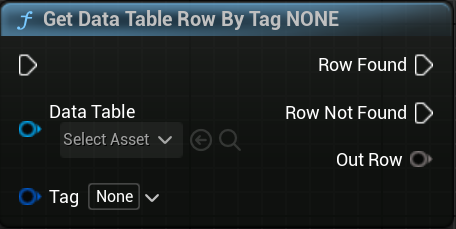
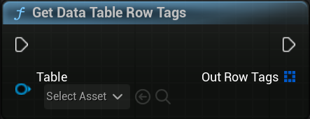

# DataTable GameplayTag nodes for unreal engine 5

## Overview

The `DataTableGameplayTag` plugin adds the following nodes to the engine:

### Get Data Table Row By Tag

This node allows you to retrieve a row from a data table by specifying a gameplay tag instead of the row name. This eliminates the need to specify the gameplay tag twice in the data table.

### Get Data Table Row Tags

With this node, you can obtain all tags associated with the rows in a data table.

## Installation
Clone or download the repository and place into the plugins folder.
